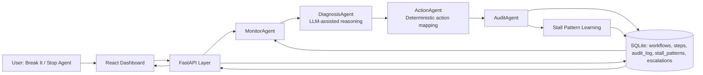

# Process Autopsy Agent - System Architecture

Autonomous system for detecting, diagnosing, and resolving workflow failures in real time.

## System Overview

Process Autopsy Agent continuously monitors purchase-to-pay workflows, detects stalled steps, and executes policy-safe remediation without waiting for manual triage. It exists to reduce payment delays, prevent SLA breaches, and provide operators with immediate visibility into why each intervention happened. The system combines autonomous execution with strict deterministic controls: diagnosis can be AI-assisted, but action selection remains rule-bound and auditable. Every issue lifecycle is persisted as evidence, so the platform is explainable under operational and compliance review. Over time, historical stall behavior feeds a learning loop that improves prioritization and intervention quality.

## Architecture Diagram

## Agent Roles

### MonitorAgent

Reads workflow and step state, identifies overdue or stalled items, and computes risk_score for prioritization. Emits normalized issue objects for downstream processing.

### DiagnosisAgent

Classifies root cause categories using contextual reasoning and confidence scoring. Uses LLM output when valid, then applies normalization and deterministic fallback when needed.

### ActionAgent

Executes deterministic remediation mapped from diagnosis class to approved operational actions. Applies state transitions directly to the database and records escalation packets when required.

### AuditAgent

Writes a complete decision record per processed issue, including workflow context, action, reasoning, confidence, and timestamp. Serves as the source of truth for traceability and UI explainability.

## Communication Flow

1. MonitorAgent identifies a stalled issue from current workflow/step state and queue order.
2. DiagnosisAgent classifies root cause and returns stall_type, reasoning, and confidence.
3. ActionAgent executes the mapped corrective action and updates workflow/step status.
4. AuditAgent logs the final decision and outcome in audit_log.
5. Learning updates stall_patterns using observed behavior and action outcomes.

Each issue is processed exactly once per cycle by combining queue-level tracking with audit_log guards, preventing duplicate handling and looped reprocessing.

## Tooling and Integrations

### FastAPI

Exposes operational endpoints such as /run-cycle, /active-issues, /audit-log, /inject-chaos, and /stop-agent. Provides the control plane for UI actions and autonomous cycle execution.

### SQLite

Persists workflows, steps, audit decisions, stall patterns, and escalations in a single transactional store. Enables deterministic reads/writes and reproducible state transitions.

### LLM (Mistral via Ollama)

Used only in DiagnosisAgent to improve classification reasoning quality. It does not directly mutate state, execute actions, or bypass deterministic policy controls.

### React Dashboard

Displays workflow heatmap, active risk queue, solved issues, audit timeline, and learned stall patterns. Also provides operator controls for injecting failures and controlling autonomous runs.

LLM output informs diagnosis quality; it does not control actions.

## Error Handling and Reliability

- LLM timeout triggers deterministic fallback classification with bounded latency.
- Invalid or malformed diagnosis outputs are normalized or rejected before action mapping.
- Duplicate processing is blocked through audit_log existence checks and per-cycle processed issue keys.
- Each issue is processed once per cycle, eliminating re-entry loops.
- Cycle-level locking prevents concurrent run-cycle execution and race conditions.

This architecture prioritizes determinism under failure: the system remains stable and operational even when AI services are slow or unavailable.

## Learning Loop (Stall Patterns)

The platform records historical stall patterns by approver, condition, and observed stall rate in stall_patterns. These signals help prioritize risk and improve diagnosis context in future cycles. As evidence accumulates, the system shifts from purely reactive handling to proactive intervention biasing.

## Why This Architecture Matters

It reduces manual intervention by turning recurring workflow failures into autonomous, policy-safe decisions. It prioritizes financial risk using explicit scoring and deterministic action execution. It provides explainable automation through a complete audit trail for every lifecycle step. It mirrors enterprise operations by combining reliability controls, operational visibility, and continuous learning in one production-ready loop.
