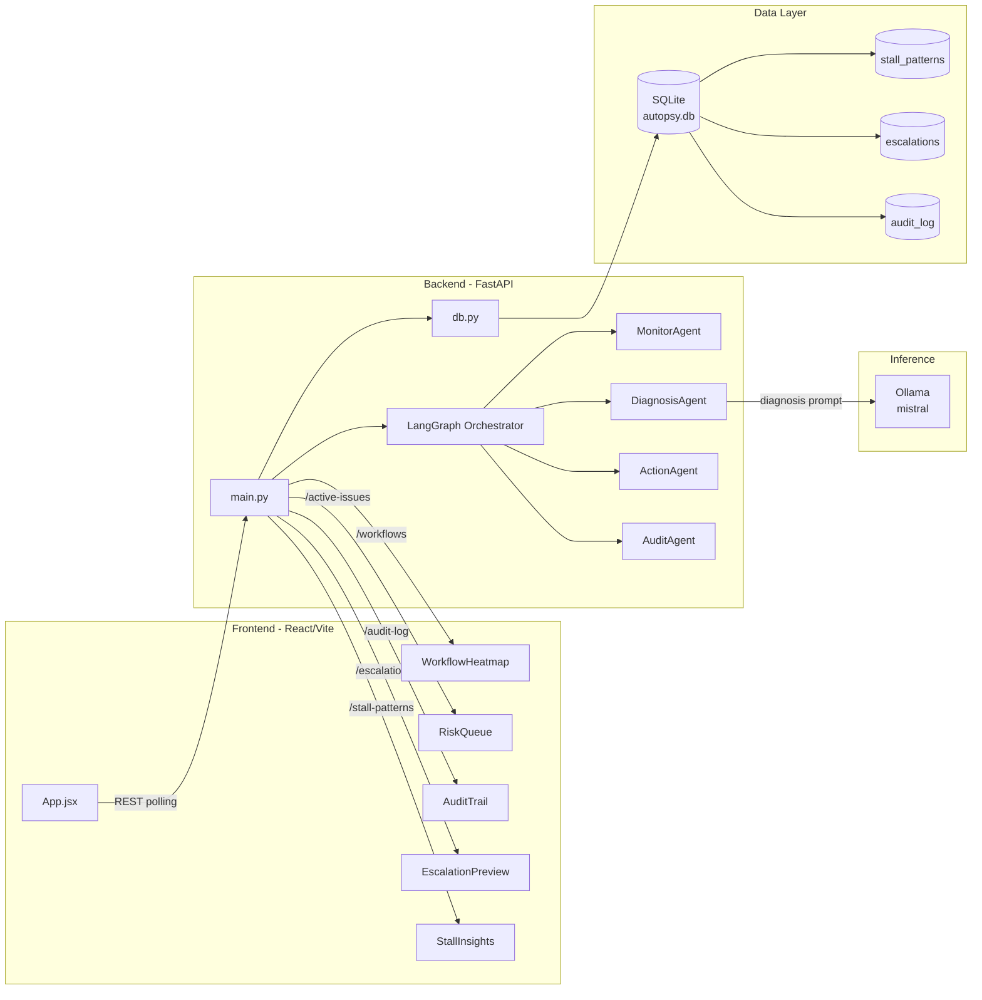
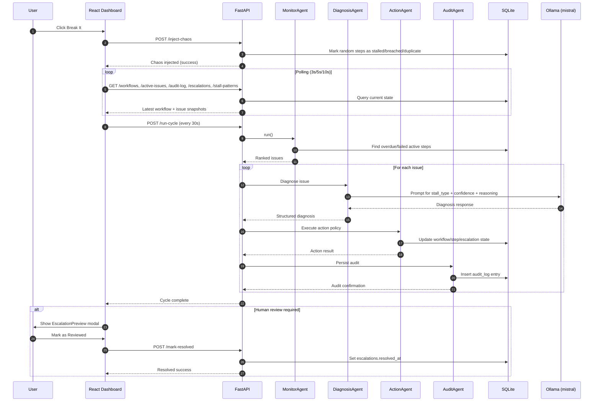

# System Architecture

This document captures the runtime architecture for the Process Autopsy Agent and links the source Mermaid diagrams used by the project.

## 1) Component Diagram

Source: [component-diagram.mmd](component-diagram.mmd)

## 2) Workflow Sequence Diagram

Source: [workflow-sequence.mmd](workflow-sequence.mmd)

## 3) Notes

- Frontend is polling-based, so UI state reflects backend changes without manual refresh.
- The diagnosis stage is the only stage that depends on LLM inference.
- Escalations support a human-in-the-loop review path via /mark-resolved.
